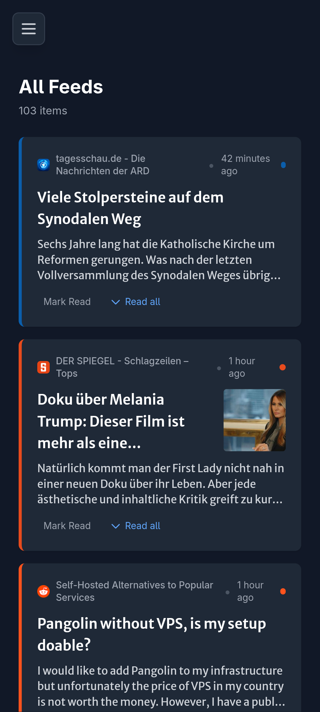
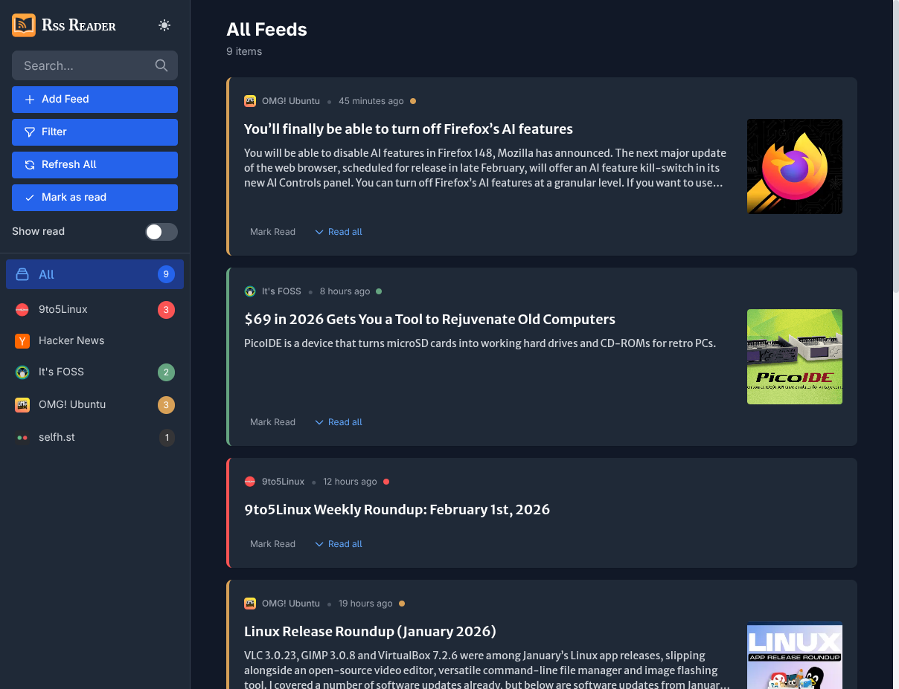
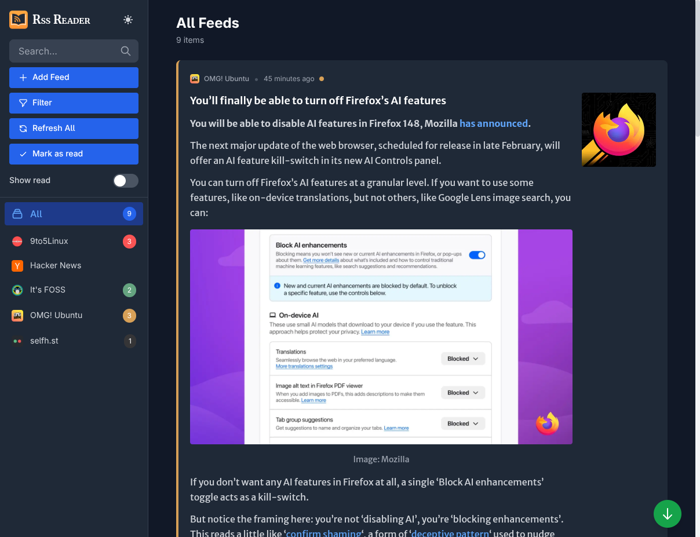
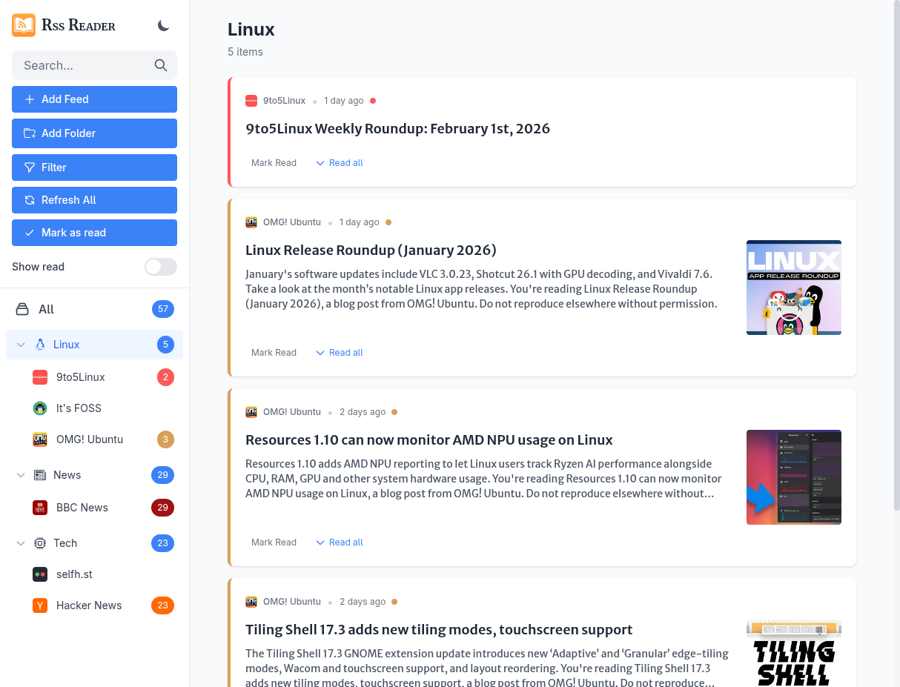

# RSS Reader


A modern RSS feed reader built with Node.js, EJS templating, SQLite database, and Tailwind CSS.

## Features

- **Feed Management**: Add, edit, and delete RSS feeds via a settings modal
- **Aggregated View**: View all items from all feeds in one place via the "All" feed
- **Feed Sidebar**: Browse individual feeds with unread counts
- **Visual Indicators**: 
  - Colored left border on cards indicates the source feed
  - Gray border for read items
  - Feed icons displayed in sidebar and on cards
- **Item Cards**: 
  - Display article title, description, and images
  - Clickable to open in new tab
  - Mark as read/unread functionality
- **Full Content Fetching**: Option to fetch and read full article content directly within the feed reader
- **Mobile Responsive**: Sidebar with hamburger menu toggle for mobile devices
- **Mark as Read by Scroll**: Articles are automatically marked as read when scrolled out of view
- **Auto Image Extraction**: Automatically extracts images from RSS feeds
- **Favicon Support**: Auto-fetches feed icons or use custom icon URLs
- **Auto Color Detection**: Automatically extracts dominant color from feed icon (server-side, no CORS issues)
- **Smart Icon Detection**: Automatically detects icon when you enter feed URL
- **Auto-Refresh**: Feeds automatically refresh every 30 minutes via cron job
- **Keyword Filtering**: RSS entries containing these keywords in their title or url will be filtered out and not added to the database.
- **Dark Mode**: Toggle between light and dark themes with persistent preference

## Screenshots

<table>
<tr>
<td rowspan="3"><a href="screenshot_mobile.png"></a><br>Mobile view of RSS Reader</td>
<td><a href="screenshot_desktop.png"></a><br>Desktop view of RSS Reader</td>
</tr>
<tr>
<td><a href="screenshot_desktop_2.png"></a><br>Alternate desktop view of RSS Reader</td>
</tr>
<tr>
<td><a href="screenshot_light.png"></a><br>Light desktop view of RSS Reader</td>
</tr>
</table>


## Tech Stack

- **Backend**: Node.js + Express
- **Templating**: EJS
- **Database**: SQLite (better-sqlite3)
- **RSS Parsing**: rss-parser
- **Image Processing**: Jimp (for color extraction) + icojs (for .ico conversion)
- **HTTP Client**: Axios (for fetching icons)
- **Styling**: Tailwind CSS (with dark mode)
- **Scheduling**: node-cron (for auto-refresh)
- **Development**: Nodemon + Concurrently

## Installation

### Using Docker Compose (Recommended)

```bash
docker-compose up -d
```

The application will be available at http://localhost:6789


### Development Mode (Manual)

```bash
npm run dev
```

### Production Mode (Manual)

```bash
# Build CSS
npm run build:css

# Start server
npm start
```

The application will be available at http://localhost:3000


## API Endpoints

- `GET /` - Main page (all items or filtered by feed)
- `GET /api/feeds` - Get all feeds
- `POST /api/feeds/detect-icon` - Detect icon and color from feed URL
- `POST /api/feeds` - Create a new feed
- `PUT /api/feeds/:id` - Update a feed
- `DELETE /api/feeds/:id` - Delete a feed
- `POST /api/feeds/:id/refresh` - Refresh a specific feed
- `POST /api/feeds/refresh-all` - Refresh all feeds
- `POST /api/items/:id/read` - Mark item as read
- `POST /api/items/:id/unread` - Mark item as unread

## How to Use

1. **Add a Feed**: Click the "Add Feed" button in the sidebar
2. **Configure Feed**: 
   - Enter the feed title
   - Enter the RSS/Atom feed URL and tab out - the icon and color will be auto-detected
   - The icon URL and color fields will be automatically filled
   - Manually adjust if desired
3. **Refresh Feeds**: 
   - Click "Refresh All" to fetch latest items manually
   - Feeds automatically refresh every 30 minutes in the background
4. **Browse Items**: 
   - Click "All" to see items from all feeds
   - Click individual feeds to filter by source
5. **Read Items**: Click any card to open the article in a new tab
6. **Manage Read Status**: Use "Mark Read/Unread" buttons to track reading progress
7. **Dark Mode**: Click the sun/moon icon in the sidebar header to toggle dark mode
8. **Mobile**: Use the hamburger menu (☰) to show/hide the sidebar on mobile devices

## License

MIT
